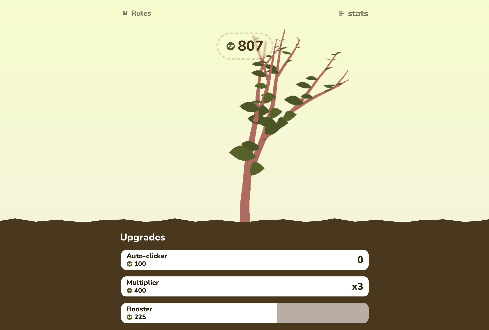

# Plant Clicker



## Demo

[Plant Clicker](https://louis-va.github.io/plant-clicker/)

## Projet Description

This project involves creating a "Cookie Clicker" game. As a team, we develop a _Cookie Clicker_ with features such as a <u>click counter</u>, <u>multipliers</u>, <u>purchase costs</u>, <u>automatic upgrades</u>, and bonuses. We'll ensure that the player cannot achieve a negative score and enhance the user interface for an appealing look.

## Skills Development

The primary goal of this project is to use pure JavaScript to collaborate effectively within our team. We will face various challenges related to _teamwork_, including _time management_, _resolving Git conflicts_, and _efficient coordination among team members_.

## Tech Stack

**Front-End:** JS, HTML5, CSS, Pixi.js, seedrandom

**Back-End:** JS, JSON

**Development Tools** : Vite, Prettier, ESLint

## Authors and Team Roles

- [@Louis Van Aken (Project Manager - Repository Manager - Designer - Front-End Developper)](https://www.github.com/louis-va)
- [@Matthieu Gravy (Front-End Developper - Readme Maintainer)](https://www.github.com/matthieuGravy)
- [@Célestin Sivixay (Back-End Developper)](https://www.github.com/Yaeshin)

## Roadmap

**Deadline**: 30/10/23 09 AM

## How to Use?

Install from `npm` or `yarn`

### Clone Locally

```bash
>  git clone git@github.com:louis-va/plant-clicker.git
```

### Install with npm

```bash
>  npm install
>  npm run dev
```